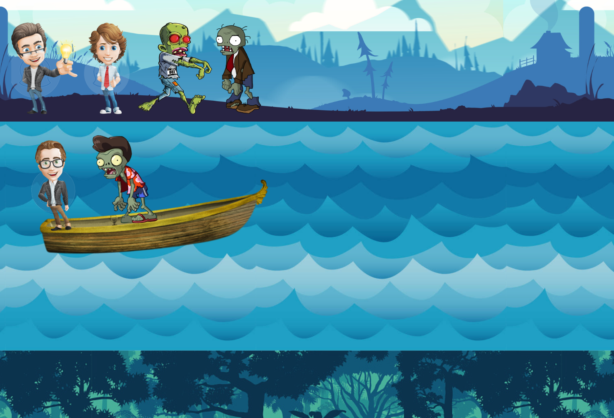

# Missionaries and Cannibals – Web Implementation

Web-based implementation of the classic **Missionaries and Cannibals** problem using **HTML**, **CSS**, and **JavaScript**.

## Problem Description

Three missionaries and three cannibals need to cross a river using a boat that can carry **a maximum of two people**. At no point (on either side of the river) can the number of cannibals exceed the number of missionaries — or the missionaries will be eaten!

The goal is to move everyone to the other side of the river safely, following these rules.

## Screenshot




## Features

- Visual interface with characters, boat, and river
- Enforced game rules (no illegal states allowed)
- Interactive gameplay using mouse events
- Feedback when the game is won or if a mistake is made


## 🛠 Technologies Used

- **HTML5** – for structure
- **CSS3** – for styling the river, characters, and boat
- **JavaScript** – for game logic, movement, and state handling

## Getting Started

1. Clone the repository:

```bash
git clone https://github.com/mr-seha/missionaries-and-cannibals.git
```

2. Open `index.html` in your browser to start the game:

```bash
open index.html
```

Or just double-click the file from your file explorer.
